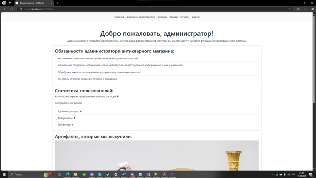
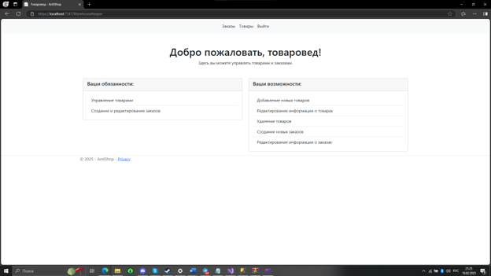
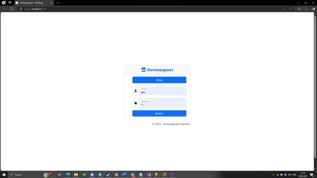
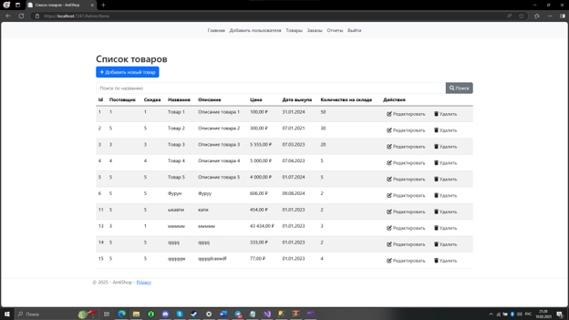
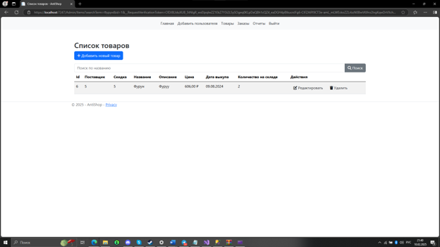
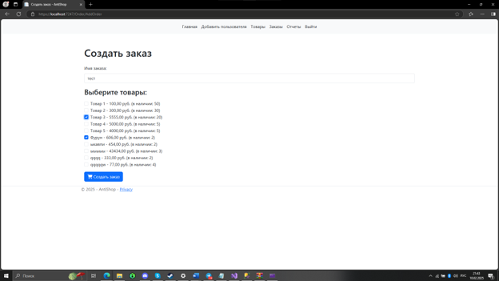
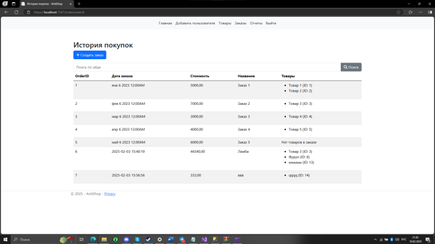
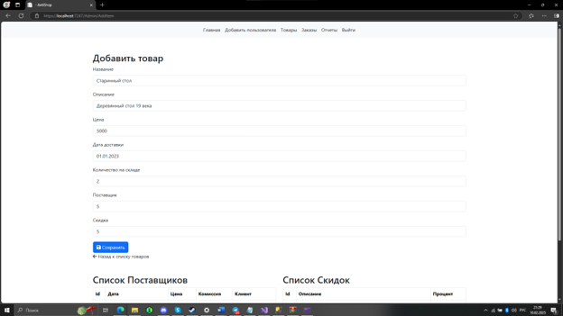
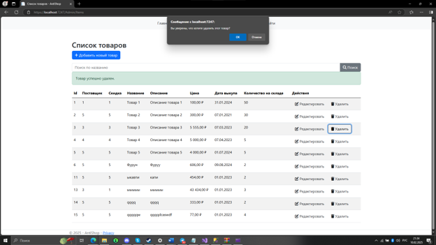
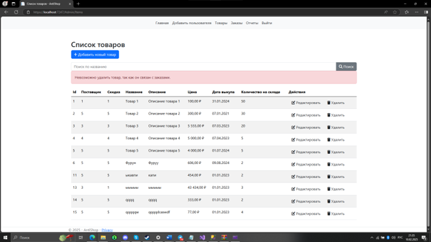

# AntiShop. Информационная система управления антикварным магазином

---

## О проекте

**AntiShop** — веб-приложение для автоматизации работы антикварного магазина, разработанное в рамках курсового проекта по дисциплине, связанной с проектированием информационных систем и веб-разработкой.

Основная цель проекта — создание единой системы для управления товарами, заказами и пользователями с разграничением прав доступа между сотрудниками магазина.

Проект моделирует реальные бизнес-процессы небольшой торговой организации и демонстрирует применение современных технологий платформы .NET для разработки корпоративных веб-приложений.

---

## Основные возможности

### Управление товарами

* Добавление новых антикварных предметов
* Редактирование характеристик товаров
* Удаление товаров из каталога
* Учет уникальных параметров каждого предмета
* Контроль складских остатков

### Управление заказами

* Создание и обработка заказов
* Автоматическое обновление остатков на складе
* Просмотр истории заказов
* Работа с клиентской базой

### Пользователи и безопасность

* Аутентификация пользователей
* Авторизация на основе ролей
* Разделение прав доступа
* Защита административного функционала

### Отчетность

* Формирование отчетов по продажам
* Просмотр статистики заказов
* Анализ данных о товарах и клиентах

---

## Ролевая модель

### Администратор

* Управление пользователями
* Полный доступ к системе
* Настройка данных магазина

### Бухгалтер

* Работа с заказами
* Просмотр отчетов
* Контроль финансовой информации

### Товаровед

* Управление каталогом товаров
* Контроль складских остатков
* Редактирование информации о товарах

---

## Технические особенности

* Архитектура ASP.NET Core MVC
* Разделение приложения на слои представления, бизнес-логики и данных
* Использование Entity Framework Core для ORM
* Валидация пользовательских данных
* Работа с реляционной базой данных SQL Server
* Интеграционное и модульное тестирование
* Подготовка проекта к развертыванию на сервере

---

## Технологический стек

| Компонент             | Технология            |
| --------------------- | --------------------- |
| Backend               | ASP.NET Core MVC      |
| Язык программирования | C#                    |
| ORM                   | Entity Framework Core |
| База данных           | Microsoft SQL Server  |
| Тестирование          | NUnit                 |
| Mock Framework        | Moq                   |
| UI-тестирование       | Selenium              |
| Контроль версий       | Git, GitHub           |
| IDE                   | Visual Studio 2022    |

---

## Структура проекта

| Папка       | Назначение                               |
| ----------- | ---------------------------------------- |
| Controllers | Контроллеры MVC                          |
| Models      | Модели предметной области                |
| Views       | Представления Razor                      |
| Data        | Контекст базы данных и миграции          |
| Services    | Бизнес-логика приложения                 |
| wwwroot     | Статические файлы (CSS, JS, изображения) |
| Tests       | Модульные и интеграционные тесты         |

---

## Реализованные сценарии

* Регистрация и авторизация пользователей
* Управление товарами
* Управление заказами
* Работа с клиентской базой
* Управление ролями пользователей
* Генерация отчетов
* Валидация данных на стороне сервера

---

## Скриншоты

### Главная страница

  

### Главная страница (альтернативный вид)

  

### Авторизация пользователя

  

### Каталог товаров

  

### Поиск товаров

  

### Создание заказа

  

### Список заказов

  

### Редактирование товара

  

### Удаление товара

  

### Обработка ошибок при удалении

  

